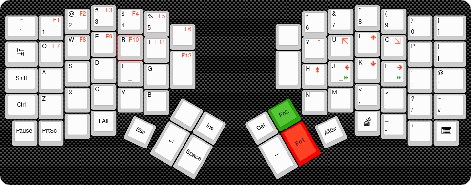

# Wil's Keyboard

This project implements a split keyboard based on the [Redox](https://github.com/mattdibi/redox-keyboard)
PCB but powered by a [SparkFun Pro Micro - RP2040](https://www.sparkfun.com/products/18288).

It features:

- Automatic main-secondary detection (either side can be connected to usb)
- Automatic chirality detection allowing the same binary to run on both sides.
- A virtual serial port to a simple CLI to help with debugging & update.
- 128x64 (SH1107 based) Oled display support

Extra optional features are also available:

- RGB Led strip

The communication between main & secondary is done through an I²C interface.

## Firmware deployment

On a fresh RP2040 enter into bootload by maintaining the boot button pressed while pressing reset.
Then run `cargo run --release` to compile and flash the firmware.

Refer to defmt documentation for available logging parameters.

I used the following command to update the firmware after the case is assembled and the buttons are
no-longer accessible.

```sh
DEFMT_BBQ_BUFFER_SIZE=4096 DEFMT_LOG=trace cargo build --release && echo -n u >> [your-uart] && sleep 5 && elf2uf2-rs -d target/thumbv6m-none-eabi/release/wilskeeb
```

## Layout

[](http://www.keyboard-layout-editor.com/##@_background_name=Carbon%20fibre%202&style=background-image%2F:%20url('%2F%2Fbg%2F%2Fcarbonfibre%2F%2Fcarbon%2F_texture1874.png')%2F%3B%3B&radii=20px&pcb:true&plate:false%3B&@_x:3.25&t=%23000000%0A%0A%23ff0000%3B&=%23%0A3%0AF3&_x:9&t=%23000000%3B&=*%0A8%3B&@_y:-0.875&x:2.25&t=%23000000%0A%0A%23ff0000%3B&=%2F@%0A2%0AF2&_x:1%3B&=$%0A4%0AF4&_x:7&t=%23000000%3B&=%2F&%0A7&_x:1%3B&=(%0A9%3B&@_y:-0.905&x:5.25&t=%23000000%0A%0A%23ff0000%3B&=%25%0A5%0AF5&_x:5&t=%23000000%3B&=%5E%0A6%3B&@_y:-0.845&a:5&w:1.25%3B&=~%0A%60&_t=%23000000%0A%0A%23ff0000&a:4%3B&=!%0A1%0AF1&_x:13&t=%23000000%3B&=)%0A0&_w:1.25%3B&=%7B%0A%5B%3B&@_y:-0.655&x:6.25&t=%23000000%0A%0A%23ff0000%3B&=%0A%0AF6&_x:3&t=%23000000&a:7%3B&=%3B&@_y:-0.72&x:3.25&t=%23000000%0A%0A%23ff0000&a:4%3B&=E%0A%0AF9&_x:9%3B&=I%0A%0A%3Ci%20class%2F='fa%20fa-arrow-up'%3E%3C%2F%2Fi%3E%3B&@_y:-0.875&x:2.25%3B&=W%0A%0AF8&_x:1%3B&=R%0A%0AF10&_x:7&fa@:0&:0&:5%3B%3B&=U%0A%0A%3Ci%20class%2F='kb%20kb-Arrows-Top-2'%3E%3C%2F%2Fi%3E&_x:1%3B&=O%0A%0A%3Ci%20class%2F='kb%20kb-Arrows-Bottom-2'%3E%3C%2F%2Fi%3E%3B&@_y:-0.905&x:5.25&f:3%3B&=T%0A%0AF11&_x:5&f:3%3B&=Y%0A%0A%3Ci%20class%2F='kb%20kb-Unicode-Page-Up-3'%3E%3C%2F%2Fi%3E%3B&@_y:-0.845&t=%23000000&a:7&fa@:7%3B&w:1.25%3B&=%3Ci%20class%2F='kb%20kb-Line-Start-End'%3E%3C%2F%2Fi%3E&_t=%23000000%0A%0A%23ff0000&a:4&f:3%3B&=Q%0A%0AF7%3B&@_y:-1&x:15.25&t=%23000000&f:3%3B&=P&_f:3&w:1.25%3B&=%7D%0A%5D%3B&@_y:-0.655&x:6.25&t=%23000000%0A%0A%23ff0000&h:1.5%3B&=%0A%0AF12&_x:3&t=%23000000&a:7&h:1.5%3B&=%3B&@_y:-0.72&x:3.25&a:4&f:3%3B&=D%3B&@_y:-1&x:13.25&t=%23000000%0A%0A%23ff0000&f:3%3B&=K%0A%0A%3Ci%20class%2F='fa%20fa-arrow-down'%3E%3C%2F%2Fi%3E%3B&@_y:-0.875&x:2.25&t=%23000000&f:3%3B&=S&_x:1&f:3&n:true%3B&=F&_x:7&t=%23000000%0A%0A%23ff0000%0A%23008000&f:3&n:true%3B&=J%0A%0A%3Ci%20class%2F='fa%20fa-arrow-left'%3E%3C%2F%2Fi%3E%0A%3Ci%20class%2F='kb%20kb-Multimedia-Rewind-Start'%3E%3C%2F%2Fi%3E&_x:1&f:3%3B&=L%0A%0A%3Ci%20class%2F='fa%20fa-arrow-right'%3E%3C%2F%2Fi%3E%0A%3Ci%20class%2F='kb%20kb-Multimedia-FastForward-End'%3E%3C%2F%2Fi%3E%3B&@_y:-0.9049999999999998&x:5.25&t=%23000000&f:3%3B&=G&_x:5&t=%23000000%0A%0A%23ff0000&fa@:0&:0&:5%3B%3B&=H%0A%0A%3Ci%20class%2F='kb%20kb-Unicode-Page-Down-3'%3E%3C%2F%2Fi%3E%3B&@_y:-0.8450000000000002&t=%23000000&a:7&w:1.25%3B&=Shift&_a:4%3B&=A&_x:13%3B&=%2F:%0A%2F%3B&_w:1.25%3B&=%2F@%0A'%3B&@_y:-0.375&x:3.25%3B&=C&_x:9%3B&=%3C%0A,%3B&@_y:-0.875&x:2.25%3B&=X&_x:1%3B&=V&_x:7%3B&=M&_x:1%3B&=%3E%0A.%3B&@_y:-0.9049999999999998&x:5.25%3B&=B&_x:5%3B&=N%3B&@_y:-0.8450000000000006&a:7&w:1.25%3B&=Ctrl&_a:4%3B&=Z&_x:13%3B&=%3F%0A%2F%2F&_w:1.25%3B&=~%0A%23%3B&@_y:-0.375&x:3.25&a:7%3B&=LAlt&_x:9&fa@:6%3B%3B&=%3Ci%20class%2F='fa%20fa-stack-overflow'%3E%3C%2F%2Fi%3E%3B&@_y:-0.875&x:2.25%3B&=&_x:11&a:4&f:3%3B&=%2F_%0A-%3B&@_y:-0.75&x:0.25&a:6&f:3%3B&=Pause&_f:3%3B&=PrtSc&_x:13&a:4&f:3%3B&=+%0A%2F=&_a:7&fa@:7%3B%3B&=%3Ci%20class%2F='fa%20fa-list-alt'%3E%3C%2F%2Fi%3E%3B&@_r:25&rx:5.135&ry:4.845&y:-0.5&x:-0.5&f:3%3B&=Esc%3B&@_r:30&rx:7.068&ry:4.875&y:-1&x:-1%3B&=&_f:3%3B&=Ins%3B&@_x:-1&f:3&h:1.5%3B&=%3Ci%20class%2F='kb%20kb-Return-2'%3E%3C%2F%2Fi%3E&_f:3&h:1.5%3B&=Space%3B&@_r:-30&rx:10.432&y:-1&x:-1&f:3%3B&=Del&_c=%232aa50a&f:3%3B&=Fn2%3B&@_x:-1&c=%23cccccc&f:3&h:1.5%3B&=%3Ci%20class%2F='kb%20kb-Arrows-Left'%3E%3C%2F%2Fi%3E&_c=%23ff0000&f:3&h:1.5%3B&=Fn1%3B&@_r:-25&rx:12.365&ry:4.845&y:-0.5&x:-0.5&c=%23cccccc&f:3%3B&=AltGr)

## Licenses

The hardware design files present in this repository under the `pcb` and `case` directories are
distributed under the [CERN OHL S v2 License](./cern_ohl_s_v2.txt).

```text
Copyright Wilfried Chauveau 2022.

This source describes Open Hardware and is licensed under the CERN-OHL-S v2.
You may redistribute and modify this source and make products using it under
the terms of the CERN-OHL-S v2 (https://ohwr.org/cern_ohl_s_v2.txt).

This source is distributed WITHOUT ANY EXPRESS OR IMPLIED WARRANTY, INCLUDING
OF MERCHANTABILITY, SATISFACTORY QUALITY AND FITNESS FOR A PARTICULAR PURPOSE.
Please see the CERN-OHL-S v2 for applicable conditions.

Source location: https://github.com/ithinuel/wilskeeb.git

As per CERN-OHL-S v2 section 4, should You produce hardware based on this source,
You must where practicable maintain the Source Location visible on the external
case of the Gizmo or other products you make using this source.
```

The sources available under the `firmware` directory are distributed under the
[Apache 2](./Apache-2.0.txt) license.

```text
Copyright 2022 Wilfried Chauveau

Licensed under the Apache License, Version 2.0 (the "License");
you may not use this file except in compliance with the License.
You may obtain a copy of the License at

    http://www.apache.org/licenses/LICENSE-2.0

Unless required by applicable law or agreed to in writing, software
distributed under the License is distributed on an "AS IS" BASIS,
WITHOUT WARRANTIES OR CONDITIONS OF ANY KIND, either express or implied.
See the License for the specific language governing permissions and
limitations under the License.
```

## Extra resources

- The 3D model for the Audio jack is available at : [Kicad-packages3D − MR#495](https://gitlab.com/kicad/libraries/kicad-packages3D/-/merge_requests/495)
- The PCB design for the OLED display can be found at : [Github − Adafruit OLED FeatherWing PCB](https://github.com/adafruit/Adafruit-OLED-FeatherWing-PCB.git)
- The PCB design for the Pro Micro RP2040 can be found at : [Github − SparkFun Pro Micro RP2040](https://github.com/sparkfun/SparkFun_Pro_Micro-RP2040.git)
